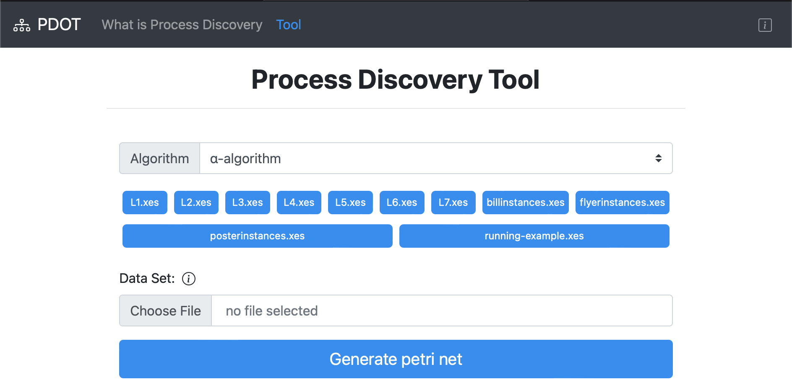
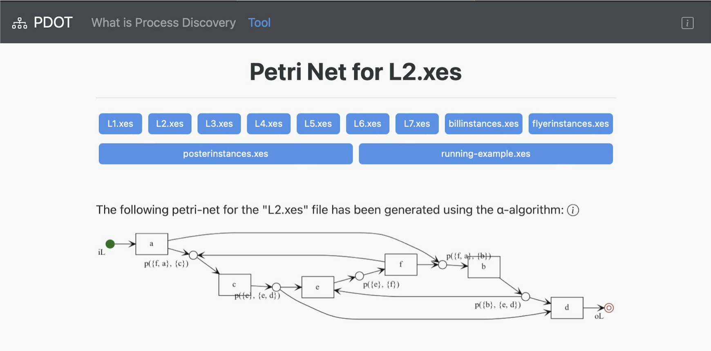

# Process Discovery Online Tool (PDOT)

## Project Overview
This project was developed at the **Technical University of Munich (TUM)** during the **Winter Semester 2022/23** as part of the practical course **"Introduction to Process Mining with Implementation of a Webservice"**.

**Process Discovery Online Tool (PDOT)** is a **web-based process mining application** that enables users to analyze and visualize business process data by generating **Petri nets** from event logs. The tool supports multiple **process discovery algorithms**, allowing for a graphical representation of complex workflows.

## Features

- **Upload Business Process Data** – Users can upload event logs for analysis.
- **Process Discovery Algorithms** – Choose between different algorithms to generate Petri nets.
- **Graphical Visualization** – Displays process models dynamically.
- **Responsive Web Interface** – Bootstrap-based UI for adaptability across devices.
- **Unit Testing Support** – Built-in unit tests to ensure algorithm correctness.

## Image Collection



## Tech Stack

### Backend
- **Python** – Core programming language.
- **Flask** – Web framework for handling server-side logic.
- **Graphviz** – Used for process visualization.
- **Local File Storage** – Stores uploaded data for processing.

### Frontend
- **HTML, CSS, JavaScript** – Web technologies for UI.
- **Bootstrap** – Used for responsive and dynamic styling.

### Development Tools
- **PyCharm** – Main IDE for development.
- **virtualenv** – For isolated Python environments.
- **pip** – Package manager for dependencies.


## Setup & Installation

### Prerequisites

- **Python 3.6+**
- **Virtualenv** (recommended for dependency management)

### Cloning the Repository
```bash
git clone <https://github.com/cristiangavriliu/process-mining.git>
cd <repository-directory>
```

### Setting Up the Virtual Environment

1. **Create a virtual environment:**

```bash
python3 -m venv .venv
```

2. **Activate the virtual environment:**

    - **Windows:**

   ```bash
   .venv\Scripts\activate.bat
   ```

    - **macOS/Linux:**

   ```bash
   source .venv/bin/activate
   ```

3. **Install required packages:**

```bash
pip install -r requirements.txt
```

4. **Freeze dependencies (for development use only):**

```bash
pip freeze > requirements.txt
```

## Running the Application

To start the application locally, run the following command:
```bash
python backend/app.py
```

The development server will be available at:
**http://[::1]:9005/index.html**

## Deploying on the Server

To run the application on the **TUM Lehr Server**, follow these steps:

```bash
ssh -i ssh_private tumkey@lehre.bpm.in.tum.de
```

```bash
git clone https://github.com/cristiangavriliu/process-mining.git
```

```bash
cd process-mining
source .venv/bin/activate
pip install -r requirements.txt
```

```bash
python3 backend/app.py
```

You can now access the website at:
**https://lehre.bpm.in.tum.de/ports/your_prot_NR/**

## Roadmap

- [x] 03.11.2022 Working Upload
- [x] 10.11.2022 Working xes interpretation + α-algorithm 1-3 implemented (1 week)
- [x] 24.11.2022 α-algorithm implemented (2 weeks)
- [x] 01.12.2022 visualisation and unit test (1 week)
- [ ] 22.12.2022 additional algorithm implementation (3 weeks)
- [ ] 29.12.2022 additional algorithm unit test (3 weeks)
- [x] 05.01.2023 rounding of the project (1 week)
- [x] 12.01.2023 !DEADLINE! upload to server  (1 week)

## Testing

Unit tests are located in the **testing** folder. To run tests on all datasets:

```bash
python testing/test_a_miner_manual.py
```

If you find any bugs or have questions, feel free to contact:
[cristian.gavriliu@tum.de](mailto:cristian.gavriliu@tum.de)

## Authors and Acknowledgment

This project was developed by **Cristian Gavriliu** as part of the **Introduction to Process Mining** practical at TUM.

For questions, contact:
[cristian.gavriliu@tum.de](mailto:cristian.gavriliu@tum.de)

## License

This project is for **personal use only**.

---

For further details, refer to the **final project documentation**.

